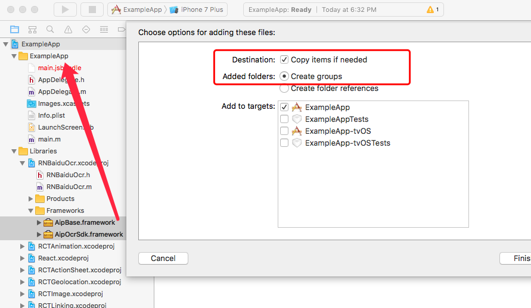
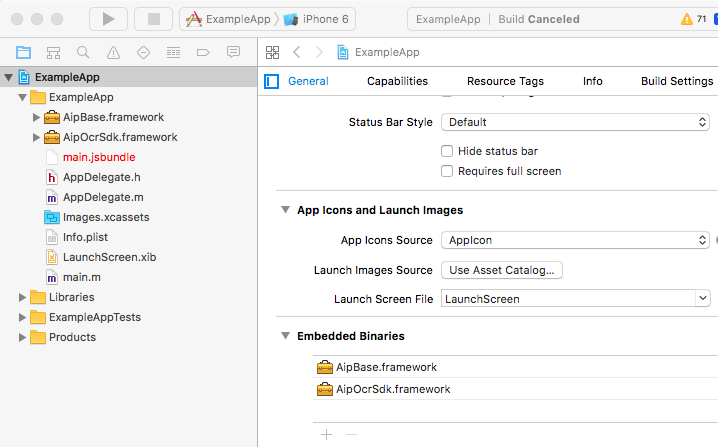

# react-native-baidu-ocr

集成百度文字识别 API SDK 的 React Native 模块，支持 Android 和 iOS 平台。百度的文字识别 API 须付费使用，但是**开发者文档很不友好，所以不推荐用它的 OCR 服务**。本项目主要目的是练习打包 RN 的原生模块，也就无所谓地狱模式了。

### [README_en](./README_en.md)
## 安装

`$ npm install react-native-baidu-ocr --save`

### 自动安装依赖

`$ react-native link react-native-baidu-ocr`

对于 iOS 平台，`link`之后还要完成手动的步骤4、5，步骤 6 可选。

### 手动安装依赖

#### iOS

1. 在 XCode 的 project navigator, 右键 `Libraries` ➜ `Add Files to [your project's name]`
2. 找到 `node_modules` ➜ `react-native-baidu-ocr` ，添加 `RNBaiduOcr.xcodeproj`
3. 在 XCode 的 project navigator, 选择你的项目。添加 `libRNBaiduOcr.a` 到你的项目的 `Build Phases` ➜ `Link Binary With Libraries`
4. 在 XCode 的 project navigator, 打开 `Libiraies`, 打开 `RNBaiduOcr.xcodeproj`, 复制 `AipOcrSdk.framework` 和 `AipBase.framework` 到以你‘项目名’命名的文件夹  

5. 在 XCode 的 Project Editor Help, 选择 TARGETS, 选择你的项目 ➜  General ➜  Embedded Binaries. 添加
`AipOcrSdk.framework` 和 `AipBase.framework`  

6. 如果你选择的使用授权文件的认证，将授权文件添加到 Xcode 以你‘项目名’命名的文件夹

#### Android

1. 打开 `android/app/src/main/java/[...]/MainActivity.java`
  - 添加 `import com.reactlibrary.RNBaiduOcrPackage;` 到文件开头位置
  - 添加 `new RNBaiduOcrPackage()` 到 `getPackages()` 方法
2. 将下列代码添加到 `android/settings.gradle`:
  	```
  	include ':react-native-baidu-ocr'
  	project(':react-native-baidu-ocr').projectDir = new File(rootProject.projectDir, 	'../node_modules/react-native-baidu-ocr/android')
  	```
3. 添加以下代码到  `android/app/build.gradle` 的 `dependencies`:
  	```
      compile project(':react-native-baidu-ocr')
  	```

## Usage
```javascript
import BaiduOcr from 'react-native-baidu-ocr';

/*
* 使用之前先获取授权认证，可以使用以下三张方法之一:
* BaiduOCR.authWithToken(String token);
* BaiduOCR.authWithAKSK(String apiKey, String secretKey)
* BaiduOCR.authWithLicenseFileData()
*/
componentDidMount(){
  BaiduOCR.authWithToken(yourAccessToken);
}

/*
* imagePath
* for Android, eg:
* "/storage/[...]/image-09cc1d6c-b6bd-40fa-a383-025b960d25a8.jpg"
* for iOS, eg:
* "file:///Users/[...]/C553DAA3-FA8D-4D77-86FF-7C4C75DFF7D7.jpg"
*/
BaiduOCR.recognizeGeneralBasic(imagePath)
  .then((data)=>{
    console.log(JSON.stringify(data))
  })
  .catch((err)=>{
    console.log(err)
  })

```

## API

更详细的API信息，可以直接参考[官方文档](http://ai.baidu.com/docs#/OCR-Android-SDK/top)

#### authWithToken(String token)
此种身份验证方案直接使用开发者提供的AccessToken

#### authWithAKSK(String apiKey, String secretKey)
此种身份验证方案使用AK/SK获得AccessToken

#### authWithLicenseFileData()
使用授权文件获得AccessToken

#### recognizeGeneral(String imagePath)
通用文字识别（含位置信息版）, 在 android 并未实现，返回结果与 recognizeGeneralBasic 相同

#### recognizeGeneralBasic(String imagePath)
通用文字识别

#### recognizeGeneralEnhanced(String imagePath)
通用文字识别(含生僻字版)

#### recognizeWebimage(String imagePath)
网络图片文字识别

#### recognizeBankCard(String imagePath)
银行卡识别

#### recognizeIDCard(String imagePath)
识别身份证文字
