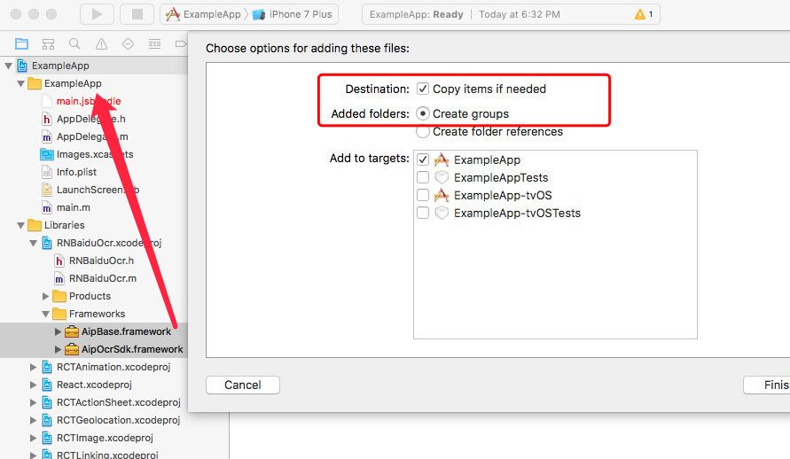

# react-native-baidu-ocr

A React Native wrapper around the Baidu OCR SDKs for Android and iOS, provides access to Baidu OCR APIs.  
Since Baidu's developer documents are extremely unfriendly, and not for free, I would not recommend you buying its service, go and find other one ...

## Getting started

`$ npm install react-native-baidu-ocr --save`

### Mostly automatic installation

`$ react-native link react-native-baidu-ocr`

** NOTE: ** After automatic installation, for iOS, you'll still need to perform step 4, 5, optional to perform step 6 of the manual instructions below.

### Manual installation

#### iOS

1. In XCode, in the project navigator, right click `Libraries` ➜ `Add Files to [your project's name]`
2. Go to `node_modules` ➜ `react-native-baidu-ocr` and add `RNBaiduOcr.xcodeproj`
3. In XCode, in the project navigator, select your project. Add `libRNBaiduOcr.a` to your project's `Build Phases` ➜ `Link Binary With Libraries`
4. In XCode, in the project navigator, open `Libiraies`, in `RNBaiduOcr.xcodeproj`, copy `AipOcrSdk.framework` and `AipBase.framework` to the folder `ExampleApp`

5. In Xcode, in Project Editor Help, TARGETS, select your project ➜  General ➜  Embedded Binaries. Add
`AipOcrSdk.framework` and `AipBase.framework`

6. If your choose to authenticate with license file, which is recommended by the official, add your license file to the folder your project's name] in Xcode

#### Android

1. Open up `android/app/src/main/java/[...]/MainActivity.java`
  - Add `import com.reactlibrary.RNBaiduOcrPackage;` to the imports at the top of the file
  - Add `new RNBaiduOcrPackage()` to the list returned by the `getPackages()` method
2. Append the following lines to `android/settings.gradle`:
  	```
  	include ':react-native-baidu-ocr'
  	project(':react-native-baidu-ocr').projectDir = new File(rootProject.projectDir, 	'../node_modules/react-native-baidu-ocr/android')
  	```
3. Insert the following lines inside the dependencies block in `android/app/build.gradle`:
  	```
      compile project(':react-native-baidu-ocr')
  	```


## Usage
```javascript
import BaiduOcr from 'react-native-baidu-ocr';

/*
* Authenticate before you use
* use either one of the following:
* BaiduOCR.authWithToken(String token);
* BaiduOCR.authWithAKSK(String apiKey, String secretKey)
* BaiduOCR.authWithLicenseFileData()
*/
componentDidMount(){
  BaiduOCR.authWithToken(yourAccessToken);
}

/*
* imagePath
* for Android, eg:
* "/storage/[...]/image-09cc1d6c-b6bd-40fa-a383-025b960d25a8.jpg"
* for iOS, eg:
* "file:///Users/[...]/C553DAA3-FA8D-4D77-86FF-7C4C75DFF7D7.jpg"
*/
BaiduOCR.recognizeGeneralBasic(imagePath)
  .then((data)=>{
    console.log(JSON.stringify(data))
  })
  .catch((err)=>{
    console.log(err)
  })

```

## API

#### authWithToken(String token)

#### authWithAKSK(String apiKey, String secretKey)

#### authWithLicenseFileData()


#### recognizeGeneral(String imagePath)
character recognition with position information, but not implemented in Android version, hence same as recognizeGeneralBasic method

#### recognizeGeneralBasic(String imagePath)
character recognition

#### recognizeGeneralEnhanced(String imagePath)
通用文字识别(含生僻字版)

#### recognizeWebimage(String imagePath)
网络图片文字识别

#### recognizeBankCard(String imagePath)
识别

#### recognizeIDCard(String imagePath)
识别身份证文字
